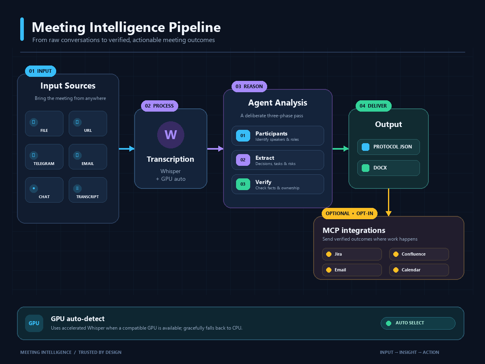

# Meeting Intelligence



**Local-first meeting intelligence** — turns audio, video, and media URLs into
timestamped transcripts, translations, and grounded meeting protocols with
decisions, assignments, and risks.

Runs locally by default. Cloud LLMs require explicit opt-in.

## Table of contents

- [Requirements](#requirements)
- [Install](#install)
  - [Option A — Standalone CLI](#option-a--standalone-cli)
  - [Option B — Hermes plugin](#option-b--hermes-plugin)
  - [Option C — Portable Agent Plugin (MCP)](#option-c--portable-agent-plugin-mcp)
- [LLM backend configuration](#llm-backend-configuration)
- [Usage](#usage)
  - [CLI commands](#cli-commands)
  - [Web dashboard](#web-dashboard)
  - [Inside a Hermes agent](#inside-a-hermes-agent)
  - [Pipeline API (Python)](#pipeline-api-python)
- [Environment variables](#environment-variables)
- [Safety](#safety)
- [Development](#development)
- [License](#license)

---

## Requirements

- Python 3.10+
- `ffmpeg` on `PATH`
- ≥ 8 GB RAM
- An LLM backend: LM Studio, Ollama, llama.cpp, or a cloud API (opt-in)
- Optional: NVIDIA CUDA GPU for faster transcription

| Platform | Install ffmpeg |
| --- | --- |
| Windows | `winget install Gyan.FFmpeg` |
| Linux | `sudo apt update && sudo apt install ffmpeg` |
| macOS | `brew install ffmpeg` |

---

## Install

Meeting Intelligence can be used three ways: as a **standalone CLI**, as a
**Hermes native plugin**, or as a **portable Agent Plugin** (MCP).

### Option A — Standalone CLI

```bash
python -m venv .venv && source .venv/bin/activate   # Windows: .\.venv\Scripts\Activate.ps1
pip install meeting-intelligence[local]
```

Optional extras:

| Extra | What it adds |
| --- | --- |
| `local` | Local LLM backend support (core deps already cover this). |
| `cloud` | Explicit cloud LLM intent. |
| `gpu` | NVIDIA CUDA runtime (Windows, Linux). |
| `diarization` | Speaker diarization via `pyannote.audio`. |
| `url` | Media URL download via `yt-dlp`. |
| `web` | Web dashboard server (`fastapi`, `uvicorn`, `python-multipart`). |
| `mcp` | MCP stdio server for Agent Plugins (`mcp` SDK). |
| `all` | Everything above combined. |
| `dev` | Test, lint, and build tools. |

### Option B — Hermes plugin

Install directly from Git — Hermes clones the repo, registers the plugin, and
adds its toolset to the agent:

```bash
hermes plugins install NikolayGusev-astra/hermes-meeting --enable
hermes gateway restart
```

Verify:

```bash
hermes plugins list          # meeting-intelligence … enabled … 0.8.0 … git
hermes tools list            # ✓ enabled  meeting_intelligence
```

Update to the latest version:

```bash
hermes plugins update meeting-intelligence
hermes gateway restart
```

Remove:

```bash
hermes plugins remove meeting-intelligence
```

### Option C — Portable Agent Plugin (MCP)

For any [agent-plugins.org](https://agent-plugins.org/) v1.0.0 compatible client
(Claude Code, Cursor, etc.):

1. Clone or download this repo.
2. The client discovers `plugin.json`, loads `skills/meeting-intelligence/SKILL.md`,
   and starts the MCP server declared in `mcp.json`:

```json
{
  "$schema": "https://agent-plugins.org/schemas/1.0.0/mcp.schema.json",
  "mcpServers": {
    "meeting-intelligence": {
      "type": "stdio",
      "command": "python",
      "args": ["-m", "meeting_intelligence.mcp_server"]
    }
  }
}
```

The MCP server exposes five tools: `meeting_transcribe`, `meeting_translate`,
`meeting_agent_transcript`, `meeting_protocol`, `meeting_process`.

Heavy dependencies (faster-whisper, CUDA, ffmpeg) must be installed in the
Python environment that runs the server.

---

## LLM backend configuration

Set three environment variables before translating or generating a protocol.
**LM Studio** (default):

```bash
export MEETING_LLM_BASE_URL=http://localhost:1234/v1
export MEETING_LLM_API_KEY=lm-studio
export MEETING_LLM_MODEL=qwen2.5-7b-instruct
```

**Ollama:**

```bash
export MEETING_LLM_BASE_URL=http://localhost:11434/v1
export MEETING_LLM_API_KEY=ollama
export MEETING_LLM_MODEL=qwen2.5-7b-instruct
```

**Cloud (opt-in):**

```bash
export MEETING_ALLOW_CLOUD=true
export MEETING_LLM_BASE_URL=https://api.openai.com/v1
export MEETING_LLM_API_KEY="$OPENAI_API_KEY"
export MEETING_LLM_MODEL=gpt-4o-mini
```

> **PowerShell:** replace `export NAME=value` with `$env:NAME = "value"`.

---

## Usage

### CLI commands

```bash
# Transcribe audio/video → timestamped transcript
meeting transcribe /path/to/meeting.mp4 --model small --language en --device cpu

# Translate transcript → target language
meeting translate /path/to/meeting.transcript.txt --target-lang ru

# Extract protocol (decisions, assignments, risks) from transcript
meeting protocol /path/to/meeting.transcript.txt --model qwen2.5-7b-instruct --docx

# Full pipeline in one step: transcribe → translate → protocol
meeting process /path/to/meeting.mp4 \
  --stt-model small \
  --llm-model qwen2.5-7b-instruct \
  --language en \
  --target-lang ru \
  --docx

# Clean transcript for agent analysis (no LLM call)
meeting agent-transcript /path/to/meeting.transcript.txt

# Launch the web dashboard
meeting serve --host 127.0.0.1 --port 8000
```

`SOURCE` may be a local audio/video file or, with the `url` extra installed, a
supported media URL (YouTube, direct links, etc.).

**GPU acceleration:**

```bash
pip install 'meeting-intelligence[gpu]'
meeting transcribe meeting.mp4 --device cuda
```

The CLI falls back to CPU if no usable GPU is found. macOS uses CPU only.

### Web dashboard

Start the server (requires the `web` extra):

```bash
pip install 'meeting-intelligence[web]'
meeting serve                    # http://127.0.0.1:8000
```

**Using the dashboard:**

1. Open `http://127.0.0.1:8000` in your browser.
2. Choose input mode:
   - **Upload File** — select a local audio/video file.
   - **Paste URL** — enter a media URL (requires `url` extra / yt-dlp).
3. Select options: STT model, source language, translation target.
4. Click **Process Meeting**.
5. The pipeline runs in the background. Status updates automatically every
   2 seconds (pending → running → done / error).
6. When done, download the transcript, translation, protocol JSON, and DOCX.

The dashboard is designed for local single-user use. It binds to `127.0.0.1`
by default and has no authentication.

**API endpoints** (for programmatic access):

| Method | Path | Description |
| --- | --- | --- |
| `GET` | `/` | Dashboard HTML page |
| `POST` | `/api/jobs` | Create job — multipart `file` upload **or** form field `url` |
| `GET` | `/api/jobs/{id}` | Poll job status and result |
| `GET` | `/api/jobs/{id}/files/{filename}` | Download an output file |

Example — create a job from a URL:

```bash
curl -X POST http://127.0.0.1:8000/api/jobs \
  -F "url=https://example.com/meeting.mp4" \
  -F "stt_model=small" \
  -F "language=en" \
  -F "target_lang=ru"
# → 202 {"id": "a1b2c3d4e5f6", "status": "pending", ...}

curl http://127.0.0.1:8000/api/jobs/a1b2c3d4e5f6
# → {"id": "a1b2c3d4e5f6", "status": "done", "result": {"files": [...]}}

curl -OJ http://127.0.0.1:8000/api/jobs/a1b2c3d4e5f6/files/meeting.protocol.json
```

### Inside a Hermes agent

Once installed via `hermes plugins install`, the agent has access to five tools
under the `meeting_intelligence` toolset. Just ask in natural language:

> «Обработай запись встречи» (with an attached audio file)
>
> «Сделай протокол по этой ссылке: https://…»
>
> «Переведи транскрипт на русский»

The agent uses the `meeting-intelligence` skill (`skills/meeting-intelligence/SKILL.md`)
to orchestrate the pipeline: it reads the transcript, enriches it with corporate
context (Jira/Confluence/Email/Calendar via MCP), and produces a grounded
protocol with `source_quote` validation.

**Available tools:**

| Tool | What it does |
| --- | --- |
| `meeting_transcribe` | Audio/video → timestamped transcript |
| `meeting_translate` | Translate transcript lines to target language |
| `meeting_agent_transcript` | Clean transcript into agent-ready JSON (no LLM) |
| `meeting_protocol` | Extract validated protocol (decisions, assignments, risks) |
| `meeting_process` | Full pipeline: transcribe → translate → protocol |

### Pipeline API (Python)

For custom integrations, import the typed pipeline API directly:

```python
from meeting_intelligence.pipeline import (
    transcribe, translate, protocol, process,
    TranscribeParams, ProtocolParams, ProcessParams,
)

# 1. Transcribe
result = transcribe(TranscribeParams(
    source="meeting.mp4",
    model="small",
    language="en",
    device="cpu",
))
print(result.transcript_path)     # Path to saved transcript
print(result.transcript[:200])    # First 200 chars
print(result.meta)                # {duration, language, segment_count, ...}

# 2. Extract protocol
proto = protocol(ProtocolParams(
    transcript=result.transcript_path,
    model="qwen2.5-7b-instruct",
    docx=True,
))
print(proto.valid)                # True/False
print(proto.protocol_path)        # Path to protocol.json
print(proto.validation)           # {errors, warnings, overall_confidence}

# 3. Full pipeline in one call
result = process(ProcessParams(
    source="meeting.mp4",
    stt_model="small",
    llm_model="qwen2.5-7b-instruct",
    language="en",
    target_lang="ru",
    docx=True,
))
```

Every function returns a typed dataclass (`TranscribeResult`,
`ProtocolResult`, `ProcessResult`) — no argparse, no stdout capture.

---

## Environment variables

| Variable | Default | Description |
| --- | --- | --- |
| `MEETING_LLM_BASE_URL` | `http://localhost:1234/v1` | LLM API endpoint |
| `MEETING_LLM_API_KEY` | `lm-studio` | LLM API key |
| `MEETING_LLM_MODEL` | `qwen2.5-7b-instruct` | LLM model name |
| `MEETING_ALLOW_CLOUD` | _(unset)_ | Set `true` to permit non-loopback endpoints |
| `MEETING_TRANSCRIBE_MODEL` | auto (`small` / `large-v3-turbo` on CUDA) | Default Whisper model |
| `MEETING_TRANSCRIBE_DEVICE` | auto | `cpu` or `cuda` |
| `MEETING_TRANSCRIBE_COMPUTE` | `int8` / `float16` (CUDA) | Whisper compute type |
| `MEETING_TRANSCRIBE_LANG` | `en` | Default source language |
| `MEETING_TRANSLATE_BATCH_SIZE` | `8` | Lines per LLM translation batch |
| `MEETING_MAX_FILE_MB` | `2048` | Max input file size |
| `MEETING_MAX_DURATION_SEC` | `7200` | Max media duration |
| `MEETING_PROTOCOL_CHUNK_SIZE` | `6000` | Token threshold for protocol chunking |
| `MEETING_AGENT_MODE` | `false` | If true, CLI prints agent-ready JSON |
| `MEETING_YT_PROXY` | _(unset)_ | HTTP proxy for yt-dlp downloads |

---

## Safety

- **Cloud blocked by default.** External endpoints are rejected unless
  `--allow-cloud` / `MEETING_ALLOW_CLOUD=true` is supplied.
- **Grounded protocols.** Every decision and assignment requires a
  `source_quote` verified against the transcript. Unverifiable items are
  flagged with warnings; fabricated items cause validation failure.
- **No secret logging.** API keys and credentials are never written to logs.
- **Audit metadata.** Each protocol includes `source_hash`, `stt_model`,
  `llm_model`, `created_at`, and `cloud_allowed` for traceability.

---

## Development

```bash
pip install -e '.[dev]'
pytest -q                          # 51 tests
ruff check .                       # lint
```

Architecture decisions: [`docs/adr/`](docs/adr/) · Design doc:
[`docs/sdd-v0.8.0.md`](docs/sdd-v0.8.0.md)

---

## License

MIT
